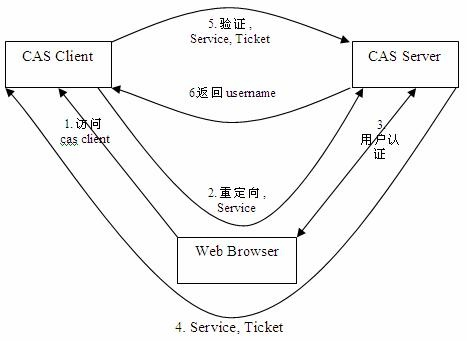
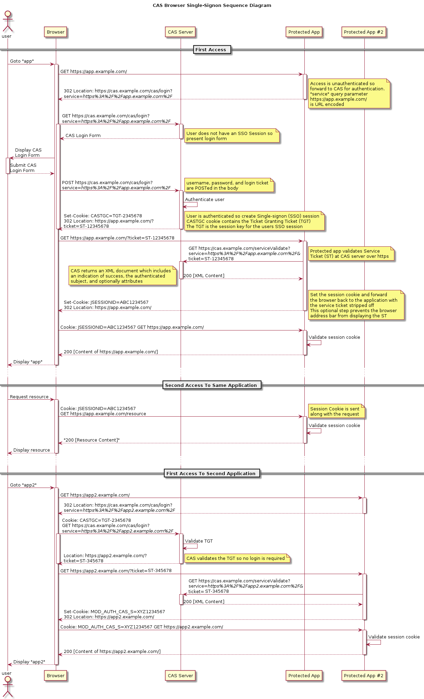

## CAS基本协议流程

## 名词
 * ### Ticket Grangting Ticket(TGT) ：
   
    TGT是CAS为用户签发的登录票据，拥有了TGT，用户就可以证明自己在CAS成功登录过。TGT封装了Cookie值以及此Cookie值对应的用户信息。用户在CAS认证成功后，CAS生成cookie（叫TGC），写入浏览器，同时生成一个TGT对象，放入自己的缓存，TGT对象的ID就是cookie的值。当HTTP再次请求到来时，如果传过来的有CAS生成的cookie，则CAS以此cookie值为key查询缓存中有无TGT，如果有的话，则说明用户之前登录过，如果没有，则用户需要重新登录。

 * ### Ticket-granting cookie(TGC)：
    存放用户身份认证凭证的cookie，在浏览器和CAS Server间通讯时使用，并且只能基于安全通道传输（Https），是CASServer用来明确用户身份的凭证。

 * ### Service ticket(ST)：
    服务票据，服务的惟一标识码 , 由 CASServer 发出（ Http 传送），用户访问Service时，service发现用户没有ST，则要求用户去CAS获取ST.用户向CAS发出获取ST的请求，CAS发现用户有TGT，则签发一个ST，返回给用户。用户拿着ST去访问service，service拿ST去CAS验证，验证通过后，允许用户访问资源

## 组成

 * ### CAS 服务端
    CASServer 负责完成对用户的认证工作 , 需要独立部署 , CAS Server 会处理用户名 /密码等凭证 (Credentials) 。

 * ### CAS 客户端
    负责处理对客户端受保护资源的访问请求，需要对请求方进行身份认证时，重定向到 CAS Server 进行认证。（原则上，客户端应用不再接受任何的用户名密码等 Credentials ）。

 * ### CASClient 
    与受保护的客户端应用部署在一起，以 Filter 方式保护受保护的资源。

## CAS Web流程

